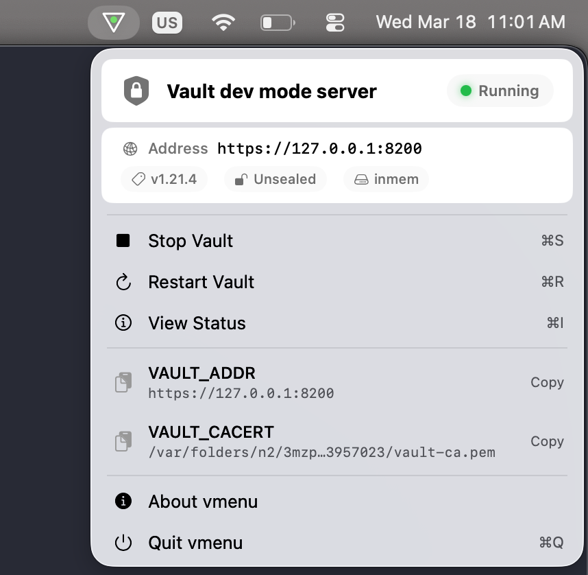
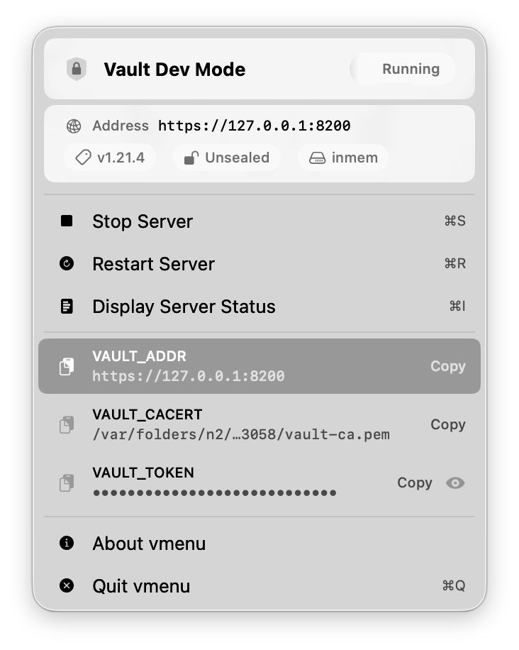
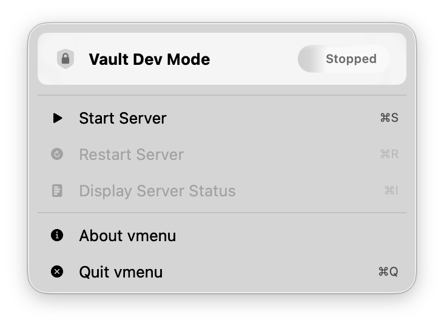

<p align="center">
  
</p>

<h1 align="center">vmenu</h1>

<p align="center">
  <strong>A native macOS menu bar app for managing HashiCorp Vault dev servers</strong>
</p>

<p align="center">
  <a href="https://github.com/brianshumate/vmenu/actions/workflows/swift.yml"></a>
  <a href="https://github.com/brianshumate/vmenu/releases/latest"></a>
  
  
  <a href="LICENSE"></a>
</p>

---

**vmenu** lives in your menu bar and gives you one-click control over a [Vault](https://www.vaultproject.io/) dev mode server. Start, stop, restart, check status, and copy environment variables — without ever opening a terminal.

## Screenshots

<table>
  <tr>
    <td align="center"><strong>Running</strong></td>
    <td align="center"><strong>Stopped</strong></td>
  </tr>
  <tr>
    <td></td>
    <td></td>
  </tr>
</table>

## Features

- **Start/stop/sestart** a Vault dev server with a click or keyboard shortcut.
- **Server readiness indicator** — green (unsealed), orange (sealed), red (stopped).
- **One-click copy** of `VAULT_ADDR`, `VAULT_CACERT`, and `VAULT_TOKEN` export commands for Terminal session or other use.
- **Server status at a glance** — version, seal status, storage backend, address.
- **macOS-native** — pure SwiftUI, lightweight, no Electron, no runtime dependencies.
- **launchd integration** — manages Vault through a proper LaunchAgent.
- **Keyboard shortcuts** for every action (⌘S, ⌘R, ⌘I, ⌘Q).

## Prerequisites

vmenu needs the `vault` binary installed and available in your `PATH`.

If you do not have Vault, you can install with Homebrew:

```shell
brew install hashicorp/tap/vault
```

If you do not use Homebrew, consider downloading a binary directly from [releases.hashicorp.com/vault](https://releases.hashicorp.com/vault), and installing in your PATH using your preferred method.

> [!TIP]
> vmenu requires **macOS 13 (Ventura) or later** through macOS 26 (Tahoe).

## Install

### Download a release (recommended)

Grab the latest DMG or zip from [**Releases**](https://github.com/brianshumate/vmenu/releases/latest), open the DMG, and drag `vmenu.app` into `/Applications`.

> [!NOTE]
> Release builds from GitHub Actions are signed and notarized.
> If macOS still shows a Gatekeeper warning, right-click the app and choose **Open**, or go to **System Settings → Privacy & Security** and click **Open Anyway**.

### Build from source

```shell
# Run in debug mode
swift run

# Build a release binary
swift build -c release

# Build and ad-hoc sign a full .app bundle
./build-app.sh release
cp -r vmenu.app /Applications/
```

## Run tests

vmenu ships with a full test suite; here's how to run the tests:

```shell
swift test
```

<details>
<summary><strong>Developer ID signing (for distribution)</strong></summary>

```shell
# Uses the first "Developer ID Application" identity in your keychain
./build-app.sh release sign

# Or specify an identity explicitly
CODESIGN_IDENTITY="Developer ID Application: Your Name (TEAMID)" ./build-app.sh release sign
```

The build script reads the latest git tag (e.g. `v1.5`) and stamps it into `CFBundleShortVersionString` and `CFBundleVersion`. If no tag exists, the version defaults to the value already in `vmenu/Info.plist`.

</details>

## How it works

vmenu is a menu bar–only app (`LSUIElement = true`) — no Dock icon, no main window. It manages the Vault dev server through a launchd LaunchAgent plist at `~/Library/LaunchAgents/com.hashicorp.vault.plist`, using `launchctl bootstrap`/`bootout`/`kickstart` subcommands. The app uses API calls to Vault for status and so on.

The menu bar icon reflects the current server state:

| Icon color | State |
|---|---|
| 🟢 Green | Vault is unsealed and ready |
| 🟠 Orange | Vault is sealed |
| 🔴 Red | Vault is stopped |

## Security model

vmenu runs _without the App Sandbox_ because it needs to spawn `launchctl` processes and write to `~/Library/LaunchAgents/`, and these are operations the sandbox does not permit. The rationale and mitigation are documented in [`vmenu/vmenu.entitlements`](vmenu/vmenu.entitlements).

That said vmenu does follow defense-in-depth with the following measures:

- **Hardened runtime** enabled for all release builds.
- **Explicitly disabled unsigned executable memory** and **library validation bypass**.
- **Ephemeral `URLSession`** use, so no credentials get cached to disk.
- **CA certificate path validation** rejects symlinks, traversal, and paths outside allowed directories.
- **Minimal attack surface**, and no document types, URL schemes, XPC services, or IPC endpoints.

> [!NOTE]
> A future architectural improvement can move `launchctl` operations into a sandboxed XPC helper (via `SMAppService`), allowing the main menu-bar app to run fully sandboxed.

## AI use disclaimer

This codebase has been built with the support of coding agents.

## License

[BSD 2-Clause](LICENSE)
